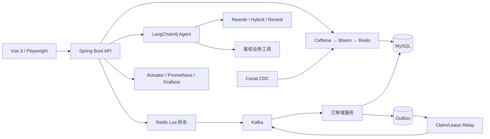
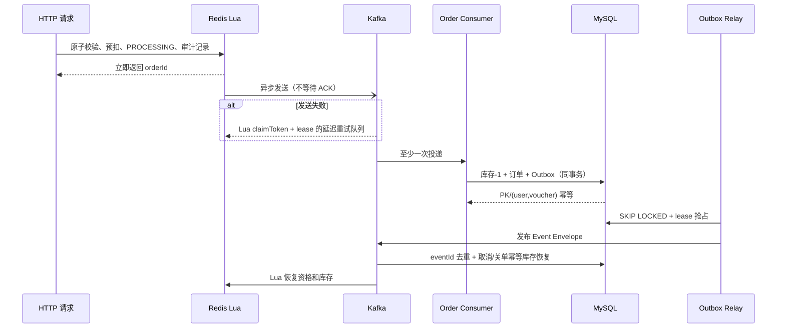
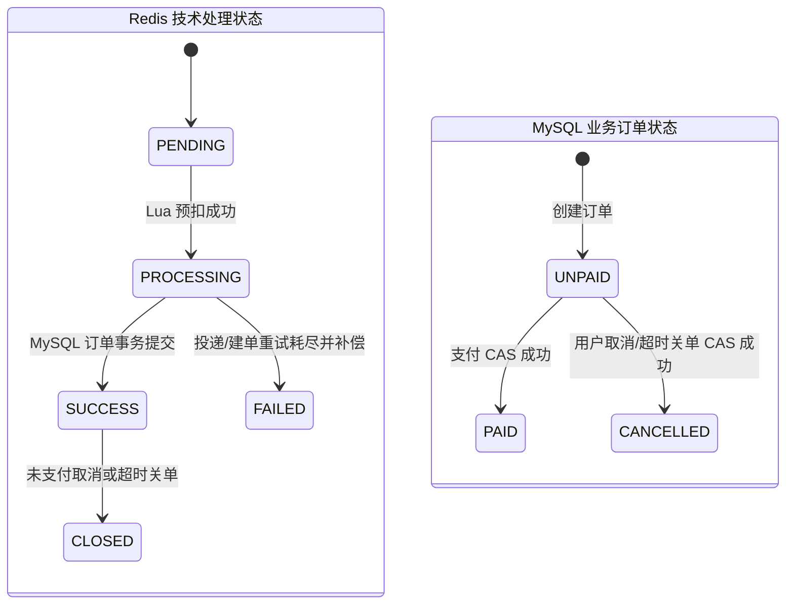

# LocalHub 架构图

## 总体架构

## 秒杀与最终一致性

## 两套订单状态的边界

技术处理状态与业务订单状态描述的是不同事实，不能合并为一个枚举：

| 时间点 | `SeckillOrderState`（Redis） | `OrderStatus`（MySQL） |
|---|---|---|
| Lua 接受请求 | `PROCESSING` | 尚无订单 |
| 建单事务提交 | `SUCCESS` | `UNPAID` |
| 支付完成 | `SUCCESS` | `PAID` |
| 取消/超时并发出 Outbox | `CLOSED` | `CANCELLED` |
| 投递或建单永久失败 | `FAILED` | 尚无订单，Redis 预扣已补偿 |

Redis 状态用于轮询异步处理进度并带 TTL；MySQL 状态是订单业务事实源。数据库 PK 与
`(user_id, voucher_id)` 唯一键始终是最终幂等防线。

## AI Agent 与 RAG

```mermaid
flowchart LR
  Q[用户问题] --> Guard[Input Guardrail]
  Guard --> Rewrite[Query Rewrite]
  Rewrite --> Hybrid[关键词 + Embedding 混合召回]
  Hybrid --> Rerank[二阶段 Rerank / 阈值拒答]
  Rerank --> Planner[Planner]
  Planner --> LLM[百炼 Qwen]
  LLM -->|选择工具| ToolGuard[Tool Guard / 用户归属校验]
  ToolGuard --> Tool[查询 / 预约预览 / 确认]
  Tool --> Memory[Redis Conversation Memory]
  LLM --> Memory
  Memory --> Output[Output Guardrail / SSE]
```

