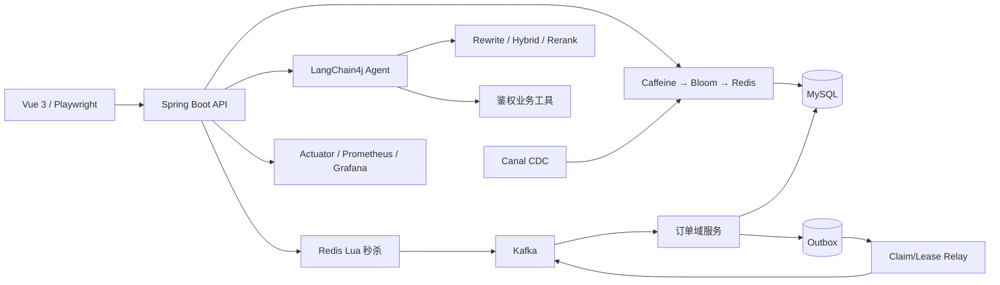
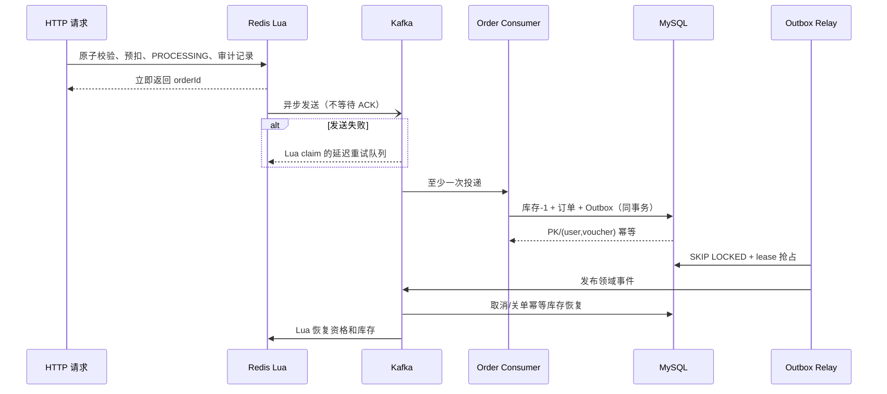

# LocalHub 架构图

## 总体架构

```mermaid
flowchart LR
  UI[Vue 3 / Playwright] --> API[Spring Boot API]
  API --> Cache[Caffeine → Bloom → Redis]
  Cache --> DB[(MySQL)]
  API --> Lua[Redis Lua 秒杀]
  Lua --> Kafka[Kafka]
  Kafka --> Order[订单域服务]
  Order --> DB
  Order --> Outbox[(Outbox)]
  Outbox --> Relay[Claim/Lease Relay]
  Relay --> Kafka
  API --> AI[LangChain4j Agent]
  AI --> RAG[Rewrite / Hybrid / Rerank]
  AI --> Tools[鉴权业务工具]
  Canal[Canal CDC] --> Cache
  API --> Metrics[Actuator / Prometheus / Grafana]
```

## 秒杀与最终一致性

```mermaid
sequenceDiagram
  participant U as HTTP 请求
  participant R as Redis Lua
  participant K as Kafka
  participant C as Order Consumer
  participant D as MySQL
  participant O as Outbox Relay
  U->>R: 原子校验、预扣、PROCESSING、审计记录
  R-->>U: 立即返回 orderId
  R-)K: 异步发送（不等待 ACK）
  alt 发送失败
    K-->>R: Lua claim 的延迟重试队列
  end
  K->>C: 至少一次投递
  C->>D: 库存-1 + 订单 + Outbox（同事务）
  D-->>C: PK/(user,voucher) 幂等
  O->>D: SKIP LOCKED + lease 抢占
  O->>K: 发布领域事件
  K->>D: 取消/关单幂等库存恢复
  K->>R: Lua 恢复资格和库存
```

## AI Agent 与 RAG

```mermaid
flowchart LR
  Q[用户问题] --> Guard[Input Guardrail]
  Guard --> Rewrite[Query Rewrite]
  Rewrite --> Hybrid[关键词 + Embedding 混合召回]
  Hybrid --> Rerank[二阶段 Rerank / 阈值拒答]
  Rerank --> Planner[Planner]
  Planner --> LLM[百炼 Qwen]
  LLM -->|选择工具| ToolGuard[Tool Guard / 用户归属校验]
  ToolGuard --> Tool[查询 / 预约预览 / 确认]
  Tool --> Memory[Redis Conversation Memory]
  LLM --> Memory
  Memory --> Output[Output Guardrail / SSE]
```
